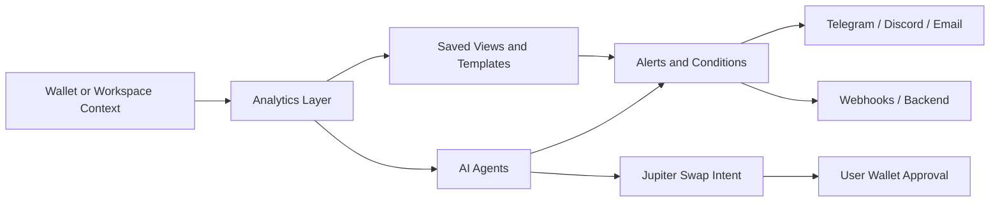

<p align="center">

<a id="readme-top"></a>

# Boometrix Console

> **Boometrix Console** is a unified workspace for on-chain analytics, AI agents, alerts, and automation  
> Explore tokens, inspect wallets, run heavy analytics, launch agents, and route events into your own stack — all without building the data layer yourself

---

### 🚀 Quick Links

[](https://твоя-web-app-ссылка)

[](https://t.me/твой_мини_апп)

[](https://твои-docs-ссылка)

[](https://x.com/твой_аккаунт)

[](https://t.me/твоя_группа_или_канал)

---

## Overview

**Boometrix Console** is the front-end layer for analytics, agents, event routing, and automated workflows

It is built for traders, funds, analytics teams, researchers, and developers who need *real on-chain visibility* plus *AI-native execution logic* in one place

Instead of splitting your flow between dashboards, scripts, bots, and manual checks, Boometrix brings everything into a single system:

- **Market data**
- **On-chain analytics**
- **AI agents**
- **Long-running jobs**
- **Alerts and webhooks**
- **Workspace-based collaboration**

> [!IMPORTANT]
> **Console = API = Protocol**  
> Every meaningful action in the UI is designed to map to an API call, job, or automation flow

> [!TIP]
> Boometrix is built to keep the *surface simple* while leaving the real power in queries, agent configs, saved views, and event pipelines

<p align="right">(<a href="#readme-top">back to top</a>)</p>

---

## What You Can Do

Use Boometrix to turn raw market and wallet activity into workflows you can actually use

### Core workflows

- Track **tokens**, **wallets**, and **cohorts** with unified metrics
- Inspect **holder concentration**, **net flows**, **whale behavior**, and **PnL**
- Run **AI-powered agents** for token scans, wallet summaries, portfolio checks, and research digests
- Launch **async analytics jobs** and **backtests** on indexed historical data
- Save reusable query templates and pin them as **Saved Views**
- Route alerts into **Telegram**, **Discord**, **email**, or your own **webhooks**
- Organize usage inside **workspace-scoped billing, keys, permissions, and automations**

### Product philosophy

Boometrix is designed around a few practical ideas:

- ***Data-first, AI-native***  
  On-chain and market data are the foundation, while AI sits directly on top as an operational layer

- ***Automation over manual work***  
  If a process can be formalized, it should be turned into a repeatable signal, report, event, or agent workflow

- ***Agents as first-class actors***  
  Agents do not exist as a chat gimmick — they observe, reason, summarize, and trigger downstream actions

> [!NOTE]
> Boometrix agents **analyze and suggest**  
> Final transaction approval still remains with the user wallet via **Jupiter**

<p align="right">(<a href="#readme-top">back to top</a>)</p>

---

## Example Scenarios

### 1) Smart money monitoring

You track a shortlist of high-performing wallets and want to know when one of them rotates into a new token

**With Boometrix you can:**

- watch wallet flows
- detect large inflows and outflows
- run a wallet agent for quick interpretation
- push the result into Telegram or your internal backend

### 2) Token due diligence

You find a token with fresh activity and want a fast decision framework before spending more time on it

**With Boometrix you can:**

- inspect liquidity and holder concentration
- review whale participation and exchange flows
- run a token risk agent
- save the result as a reusable view for later monitoring

### 3) Portfolio health check

You want a daily summary across several connected wallets without opening five different apps

**With Boometrix you can:**

- aggregate exposure across wallets
- review performance and concentration
- generate a portfolio digest
- send the result to Telegram, Discord, or email on schedule

### 4) Quant and research workflow

Your team needs historical scans and repeatable analytics without building a custom indexing stack from scratch

**With Boometrix you can:**

- create parameterized templates
- run long backtests and heavy jobs
- export structured results
- feed downstream BI tools, dashboards, and bots

<p align="right">(<a href="#readme-top">back to top</a>)</p>

---

## Features

### Analytics and market intelligence

- **Market & order book data**
- **OHLCV candles and ticker data**
- **Token analytics**
- **Wallet analytics**
- **Cohort and smart money tracking**
- **Flow monitoring and whale detection**

### Agents and automation

- **Token risk agents**
- **Wallet behavior agents**
- **Portfolio health agents**
- **Research and narrative digest agents**
- **Scheduled automations**
- **Webhook-based event routing**

### Workspace and delivery layer

- **Multiple workspaces per user**
- **Role-based access control**
- **Workspace-scoped API keys**
- **Saved Views and reusable query templates**
- **Telegram mini app and chat-based bot delivery**
- **BI export and data pipeline support**

> [!WARNING]
> Credits are consumed by API calls, analytics queries, agents, and heavy jobs  
> High-cost actions should always surface usage clearly in the UI

### Snapshot of key system capabilities

| Area | What it covers |
|---|---|
| Analytics | Tokens, wallets, cohorts, flows, performance |
| Agents | Token, wallet, portfolio, research |
| Automation | Schedules, event triggers, webhooks |
| Delivery | Console, Telegram Mini App, Discord, API |
| Collaboration | Workspaces, roles, shared views |
| Monetization | Credit model with $BLMX plan flow |

<p align="right">(<a href="#readme-top">back to top</a>)</p>


---

## Getting Started

### 1) Create your workspace

- Sign in
- Create or join a workspace
- Configure roles, usage scope, and API access

### 2) Connect your wallet

Your wallet acts as the main identity layer across the web app, mini app, and extension

### 3) Set your default context

Choose:

- default network
- quote currency
- watchlists
- timezone
- notification channels

### 4) Run your first workflow

A typical first flow looks like this:

```text
Connect wallet
→ open token or wallet analytics
→ run an agent
→ review structured output
→ save the result
→ attach an alert or webhook
```

### 5) Move into automation

Once your first manual flow works, convert it into a repeatable system using playbooks, schedules, and event routing

#### Example sync agent request

```js
fetch('https://api.bloometrix.com/v1/agents/agt_123/run', {
  method: 'POST',
  headers: {
    'Authorization': 'Bearer YOUR_API_KEY',
    'Content-Type': 'application/json'
  },
  body: JSON.stringify({
    input: {
      mode: 'token',
      chain: 'solana',
      tokenAddress: 'So1111...',
      lookbackDays: 7
    }
  })
})
```

#### Example async job request

```js
fetch('https://api.bloometrix.com/v1/jobs', {
  method: 'POST',
  headers: {
    'Authorization': 'Bearer YOUR_API_KEY',
    'Content-Type': 'application/json'
  },
  body: JSON.stringify({
    type: 'backtest',
    name: 'solana-rotation-q1',
    params: {
      chain: 'solana',
      from: '2026-01-01T00:00:00Z',
      to: '2026-03-01T00:00:00Z'
    },
    webhookUrl: 'https://your-backend.com/webhooks/bloometrix/jobs'
  })
})
```

> [!TIP]
> Separate your API keys by environment  
> Use different keys for **dev**, **staging**, and **production**

<p align="right">(<a href="#readme-top">back to top</a>)</p>

---

## Inside the Flow

Instead of a generic “how it works” block, this section shows how value moves through the system



### Why this structure matters

**Boometrix does not stop at dashboards**

It is designed so that one insight can evolve into a reusable system:

- a token check becomes a saved workflow
- a wallet scan becomes a scheduled digest
- an agent result becomes a webhook event
- a repeated analysis becomes a backtest or playbook

### Operational model

```text
Data enters through market feeds, indexed on-chain activity, and tracked wallet behavior

That data becomes templates, dashboards, and agent-ready context

Agents transform structured inputs into readable summaries plus machine-usable metrics

Events, alerts, and jobs move those outputs into bots, dashboards, and internal systems
```

> [!IMPORTANT]
> The execution boundary is deliberate  
> Boometrix can prepare a swap intent through **Jupiter**, but the final approval always happens in the **user wallet**

<p align="right">(<a href="#readme-top">back to top</a>)</p>

---

## FAQ

### Is Boometrix only for traders

**No**  
It is useful for traders, funds, analytics teams, product teams, and developers who need on-chain and market intelligence with automation

### Do I need to run my own nodes

**No**  
Boometrix handles the node and indexing layer so you can consume normalized data through the Console and APIs

### Does everything in the Console exist in the API

**Yes**  
The product is designed around a shared model where UI actions map to APIs, jobs, templates, or automations

### Can I get real-time alerts

**Yes**  
You can define conditions and route notifications into in-app surfaces, chat tools, email, or custom webhooks

### Do agents execute swaps automatically

**No**  
Agents analyze and suggest  
Any swap action still requires explicit confirmation from the user wallet

### How do credits work

Each action consumes credits based on cost and complexity  
Light token checks are cheap, while wallet analytics, research digests, and heavy jobs consume more

<p align="right">(<a href="#readme-top">back to top</a>)</p>

---

## Roadmap

- [x] Core Console structure
- [x] Workspace model and role-based access
- [x] Token and wallet analytics
- [x] Agent runs and async jobs
- [x] Alerts, webhooks, and event streams
- [ ] Public visual dashboard for burn, supply, and treasury flow
- [ ] Expanded playbook library with more presets
- [ ] Multi-language support
  - [ ] Chinese
  - [ ] Spanish

See the [open issues](https://github.com/othneildrew/Best-README-Template/issues) for a full list of proposed features and improvements

<p align="right">(<a href="#readme-top">back to top</a>)</p>

---

## Architecture Notes

### Identity and access

- Wallet-first identity across product surfaces
- Workspace-scoped billing, keys, and permissions
- Role-based access for owners, admins, and analysts

### Protocol value flow

- Paid plans and top-ups are purchased in **$BLMX**
- **80%** of received BLMX is burned
- **20%** is routed to the treasury
- A public dashboard can expose burn totals, treasury balance, and supply tracking

### Data and security

- API keys are workspace-scoped
- Sensitive values should be stored securely and rotated regularly
- Webhook events are signed with **HMAC-SHA256**
- Private keys and seed phrases are **never stored**

<p align="right">(<a href="#readme-top">back to top</a>)</p>

---

## Disclaimer

> [!CAUTION]
> Boometrix provides analytics, automation infrastructure, and AI-generated summaries for research and operational support  
> It does **not** guarantee outcomes, and nothing in the product should be treated as financial advice

> [!NOTE]
> Agents analyze and structure information  
> They do not replace your own judgment, execution controls, or wallet approval flow

---

## Support

For docs, onboarding, integrations, and updates, use the links at the top of this README

<p align="right">(<a href="#readme-top">back to top</a>)</p>
